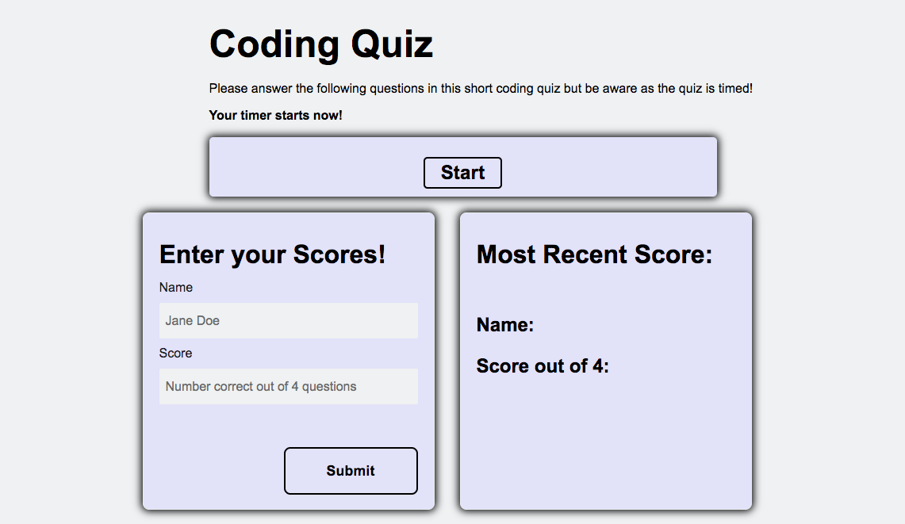

# Coding-Quiz

## Description

On this project, I created a coding quiz from scratch so that a user can go through the timed quiz, answer the questions presented to them as well as they can, and submit their score on the quiz to the website's local storage.

This website was created using HTML, CSS, and Javascript. I'm hoping in the future I would be able to create better accessibility for the users.

[Link to live site.](https://margaretelson.github.io/Coding-Quiz/)

## Built With

The following features were used in creating this website:
* HTML
* CSS
* JavaScript
* Git & Git workflow
* GitHub

## Installation

Use VSCode to install.

## License

MIT License

- Copyright (c) 2020 Margaret Elson
